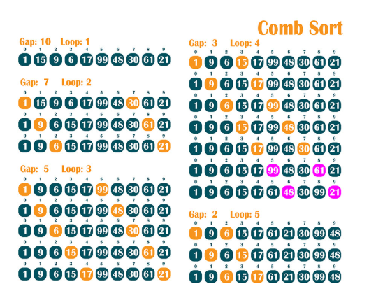

Il est important de documenter vos résultats dans un fichier README.md. Vous y inclurez vos observations sur les performances des algorithmes et des analyses concernant leur complexité.

markdown
Copier
# Analyse des Algorithmes de Tri

## Algorithmes Implémentés :
- Tri par sélection :

- Tri à bulles :

- Tri par insertion :

- Tri par fusion :

- Tri rapide :

- Tri par tas :

- Tri à peigne :
  

## Performances
Les temps d'exécution des algorithmes sont mesurés en fonction de la taille de la liste et de la distribution des éléments.

### Observations :
- Le tri rapide et le tri fusion sont généralement les plus performants pour des listes de grande taille.
- Le tri à bulles et le tri par sélection sont très inefficaces pour les grandes listes.

## Conclusion
Le tri rapide est l'algorithme de tri le plus rapide pour des listes de taille moyenne à grande. Cependant, pour de très petites listes, des algorithmes comme le tri par insertion peuvent être plus efficaces.
