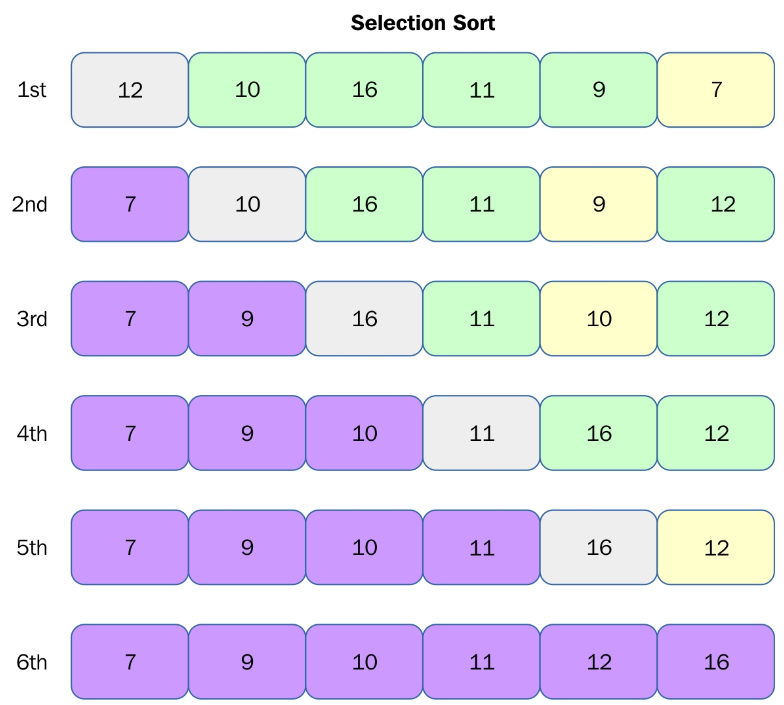
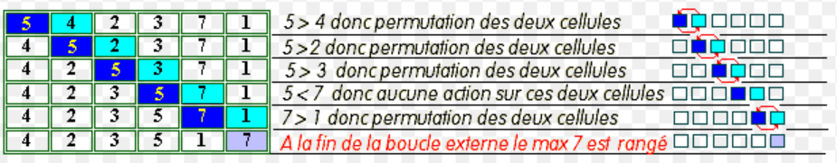
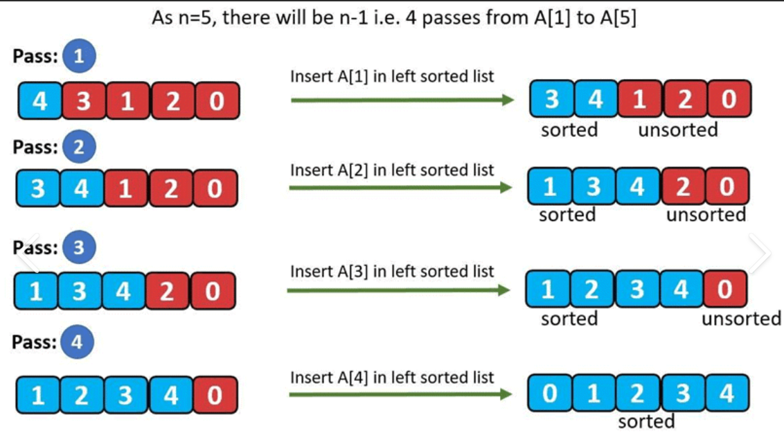
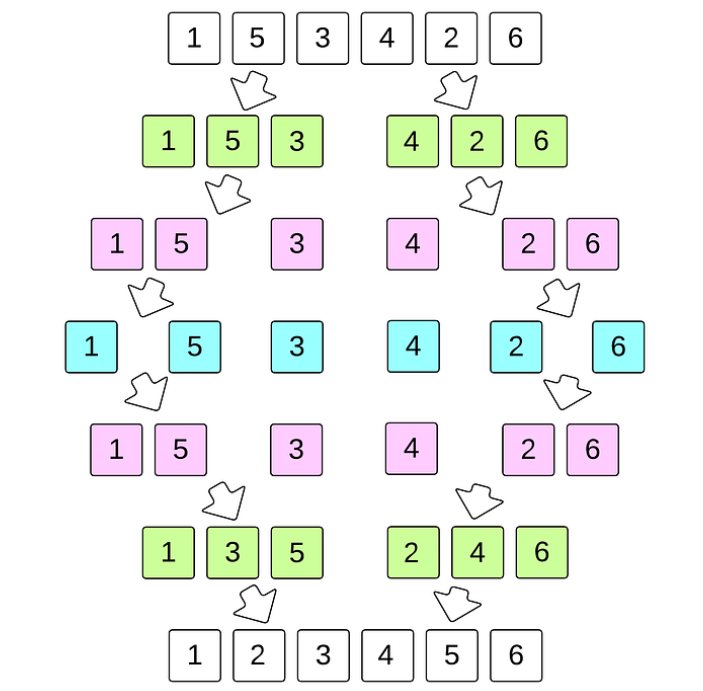
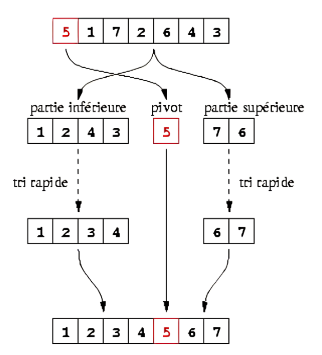
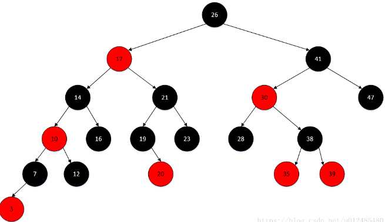
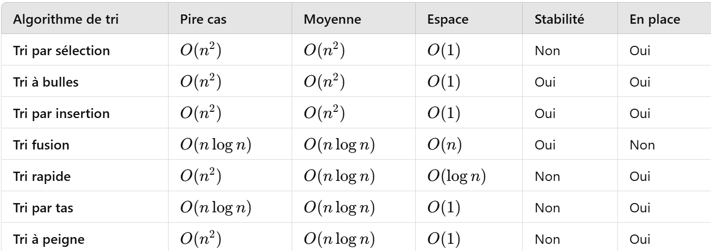

# Analyse des Algorithmes de Tri

## Algorithmes Implémentés :

### 1- Tri par sélection :
L'algorithme parcourt la liste et sélectionne l'élément le plus petit (ou le plus grand, selon l'ordre voulu) à chaque étape, puis le place à la bonne position dans la liste.

### 2- Tri à bulles :
Il compare chaque paire d'éléments adjacents et les échange si nécessaire. Ce processus est répété jusqu'à ce que la liste soit triée.

### 3- Tri par insertion :
L'algorithme construit progressivement une sous-liste triée en insérant chaque nouvel élément à la bonne position dans la sous-liste déjà triée.

### 4- Tri fusion :
Il divise la liste en sous-listes plus petites, les trie récursivement, puis fusionne ces sous-listes triées pour obtenir la liste triée finale.

### 5- Tri rapide (QuickSort) :
Il choisit un élément pivot, sépare la liste en deux parties (les éléments inférieurs et supérieurs au pivot), puis trie récursivement les deux parties.

### 6- Tri par tas (HeapSort) :
Il construit un tas (une structure de données similaire à un arbre binaire), extrait l'élément maximum (ou minimum) à chaque étape et le place dans la liste triée.

### 7- Tri à peigne : 
Cet algorithme fonctionne en réduisant progressivement l'écart (gap) entre les éléments comparés et en les échangeant si nécessaire. Cela permet de déplacer les éléments plus rapidement vers leur position correcte. 

### - Critère de comparaison des algorithmes de tri : 
complexité temporelle (pire cas / en moyenne); complexité spatiale; stabilité; caractère en place.

# Performances :
Les temps d'exécution des algorithmes sont mesurés en fonction de la taille de la liste et de la distribution des éléments.

# Observations :
#### - Le tri rapide et le tri fusion sont généralement les plus performants pour des listes de grande taille.
#### - Le tri à bulles et le tri par sélection sont très inefficaces pour les grandes listes.

# Conclusion:
#### - Le tri par sélection a une performance 𝑂(𝑛2)O(n 2) dans tous les cas, mais il est en place et nécessite peu de mémoire.
#### - Le tri fusion offre une meilleure performance théorique 𝑂(𝑛log𝑛), mais il n'est pas en place car il nécessite de la mémoire pour stocker des sous-tableaux.
#### - Le tri rapide est un algorithme très efficace en moyenne, mais son pire cas est moins bon que celui du tri fusion.
#### - Le tri par tas offre une bonne performance O(nlogn), mais il n'est pas stable.